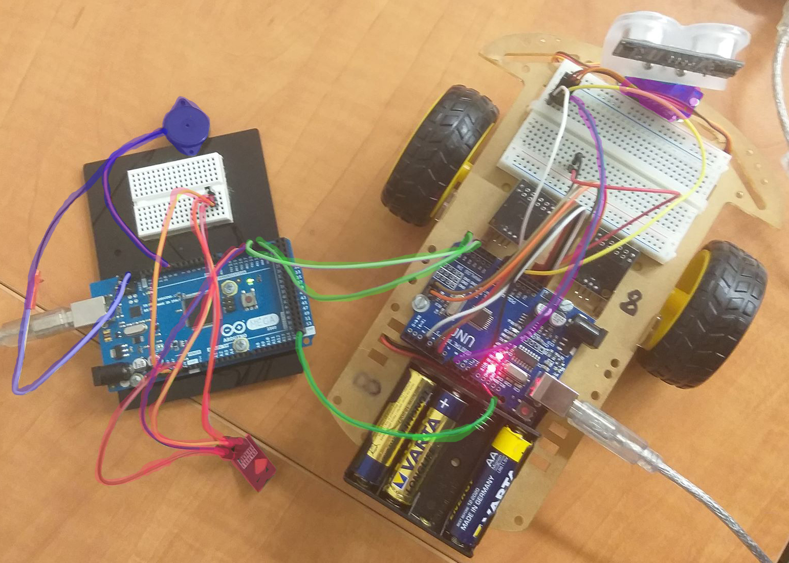

# Wi-Fi Robot Controller
This is my project for the 'Design with Microprocessors' laboratory project.

**Requirement** 
For my project I had to develop a WiFi controller for the experimental robot that is given at the laboratory. Thus, the user should be able to connect to the robot with a mobile device through a WiFi connection and control the actions of the robot with it. Available actions: go forwards, go backwards, turn left/right, accelerate, decelerate, honk and use the servo motor.

**HDL** 
The components used for the project are: the experimental robot available at the lab, Arduino MEGA 2560 board, ESP8266 WiFi module, speaker module. Since the UNO board on the robot was already crowded enough I decided to connect a MEGA 2560 board to it using I2C communication and then connecting the other components to the latter. Thus, the MEGA board would receive a signal through the WiFi module, send it to the UNO board and it would perform an action accordingly.

 

